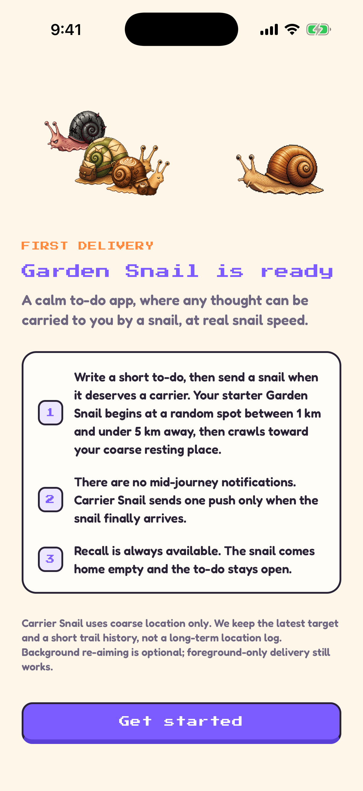
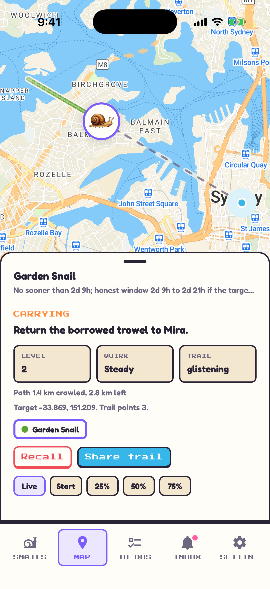
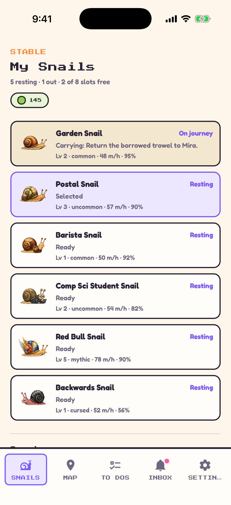
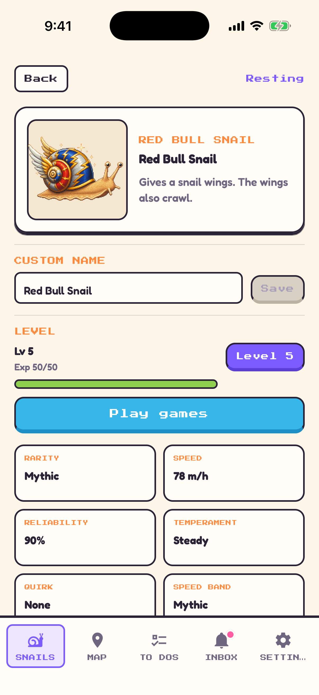
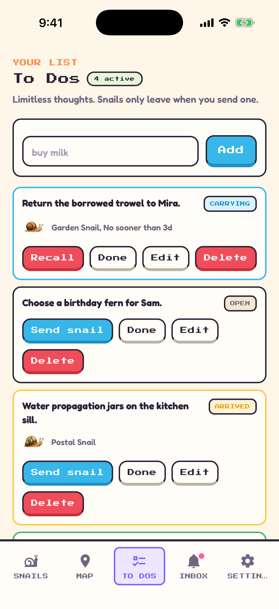
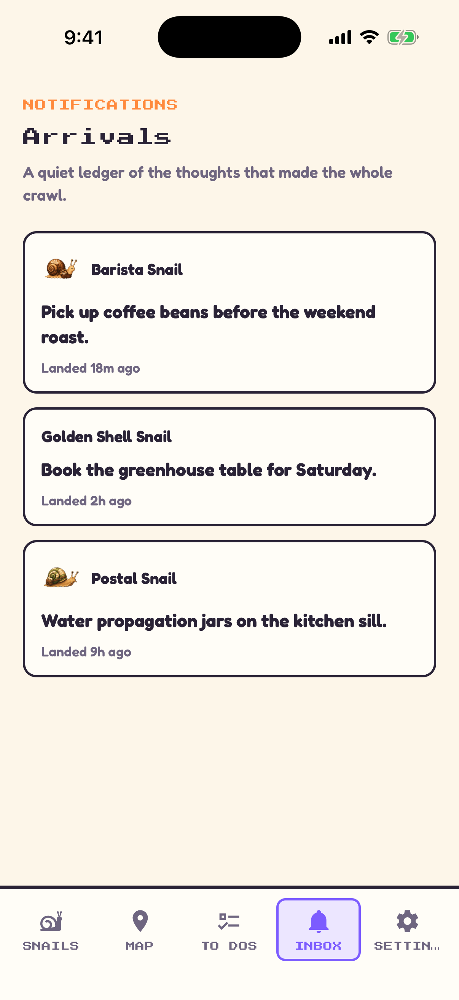
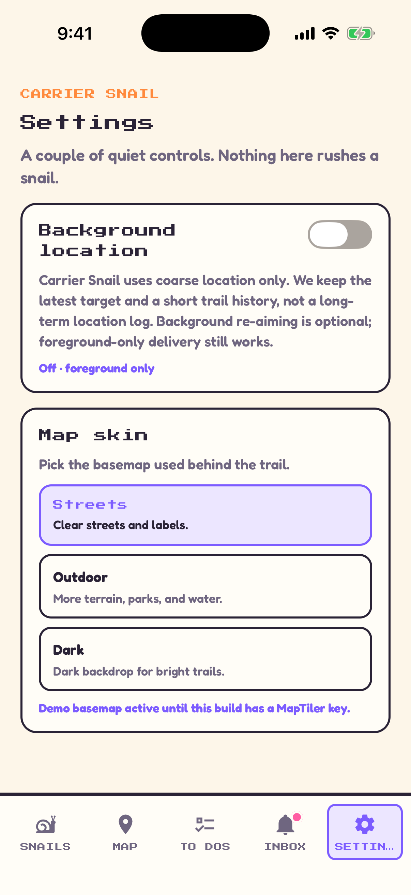

<p align="center">
  
</p>

# Carrier Snail

Carrier Snail is an Expo/React Native app where reminders crawl across a real
map at snail speed. The constitution in `specs/` is the source of truth; the
Delivery Floor must never be bypassed.

## App preview

<table>
  <tr>
    <td align="center"><br><strong>Intro</strong></td>
    <td align="center"><br><strong>Map</strong></td>
    <td align="center"><br><strong>My Snails</strong></td>
    <td align="center"><br><strong>Snail Details</strong></td>
  </tr>
  <tr>
    <td align="center"><br><strong>Flappy Snail</strong></td>
    <td align="center"><br><strong>To Dos</strong></td>
    <td align="center"><br><strong>Notifications</strong></td>
    <td align="center"><br><strong>Settings</strong></td>
  </tr>
</table>

## Local development

Install dependencies:

```sh
npm install
```

Run the green gate:

```sh
npm run typecheck
npm run lint
npm test
npm run build
```

Run the Phase 0 native dev build:

```sh
npm run ios
# or
npm run android
```

MapLibre React Native is native code and does not run in Expo Go or on web — use
a dev build (`npm run ios` / `npm run android`).

### Map basemap (important)

The default style, `https://demotiles.maplibre.org/style.json`, is a **keyless
placeholder** with only low-zoom world data — it shows continents, not streets,
so the app frames it out to a world view. For a real city-level basemap (and to
see the snail crawl on actual roads), set a free
[MapTiler](https://cloud.maptiler.com) style + key in `.env`:

```sh
EXPO_PUBLIC_MAP_STYLE_URL=https://api.maptiler.com/maps/streets-v2/style.json?key=YOUR_MAPTILER_KEY
```

Self-hosted Protomaps on Cloudflare R2 is the keyless, zero-egress option for
scale (see `specs/tech-stack.md`).

### Running on a physical device

A dev build downloads its JS from Metro on every launch, so **Metro must be
running** (`npx expo start`, or the terminal left open by `npm run android`), and
the phone must be able to reach it: put the phone on the **same Wi-Fi as your
computer**, or keep it on USB and run `adb reverse tcp:8081 tcp:8081`. A white
screen followed by an error almost always means Metro isn't running or isn't
reachable — not a code problem.

## Backend spine

Issue #4 adds the Supabase foundation without requiring credentials for local
demo mode. To exercise backend persistence, apply the migration in
`supabase/migrations/` to a Supabase project and set:

```sh
EXPO_PUBLIC_SUPABASE_URL=...
EXPO_PUBLIC_SUPABASE_PUBLISHABLE_KEY=...
```

When those values are absent, the app keeps using the existing in-memory local
state.

## Backend arrival worker

The scheduled arrival path lives in `runScheduledArrivalWorker`. It evaluates
pending journeys from the repository, uses the server `Clock` plus the Delivery
Floor ETA, sends exactly one arrival push through `PushSender`, then persists the
arrived journey, delivered reminder, and resting snail state.

Local/dev verification does not need real push credentials:

```sh
npm test -- --runTestsByPath src/useCases/runScheduledArrivalWorker.test.ts
```

Production scheduling should run the same use-case with a service-role Supabase
client, `SupabaseCarrierRepository`, and a `PushSender` implementation that
delivers through Expo Push.

## Foreground target updates

Foreground location updates run through `updateForegroundTarget`, which rounds
samples to roughly 50 m before persistence, re-aims active journeys from their
stored parameters, and retains only the latest target plus a short trail history.

## Optional background location

Background re-aiming is opt-in. The app asks for foreground permission first,
then background permission with plain copy that says the mode is optional and
coarse. If background permission is denied, foreground-only re-aiming still
works.

The Expo adapter uses `expo-task-manager` with balanced accuracy, 500 m movement
spacing, deferred updates, and automatic pausing. It requires a native dev build
or release build; Expo Go does not support background location.
